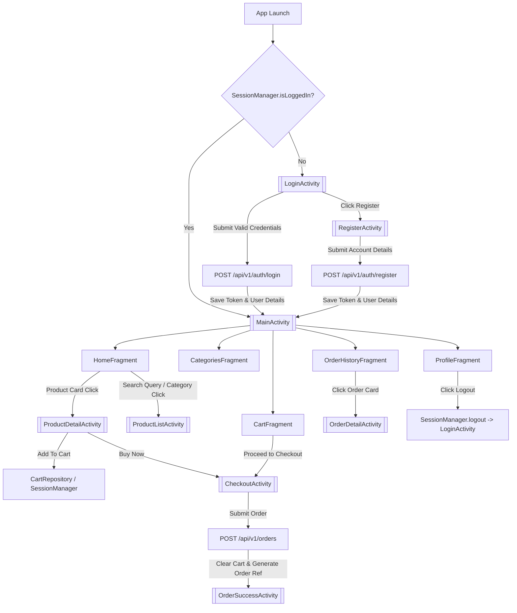

# Customer Shopping App — Android Project Documentation

## 1. Project Overview

* **Project Name:** Customer Shopping App (Retail Flow)
* **Application ID / Package Name:** `com.retail.customershoppingapp`
* **Language:** Java 11 (Source & Target Compatibility)
* **Build System:** Gradle (Kotlin DSL `build.gradle.kts` with Version Catalog `libs.versions.toml`)
* **Android Gradle Plugin (AGP) Version:** `9.2.1`
* **Compile SDK:** `36`
* **Target SDK:** `35`
* **Minimum SDK:** `24`
* **Backend Base URL:** `http://10.24.34.251:8080/` (Configured in `app/build.gradle.kts` via `BuildConfig.BASE_URL`)
* **Primary Target Backend:** `retail-flow-backend` (Spring Boot 3.x REST API)

---

## 2. Technology Stack

* **Programming Language:** Java 11
* **UI Framework:** Android XML Layouts, Material Design 3 (`com.google.android.material`), ViewBinding
* **Networking & HTTP:** Retrofit `2.11.0`, OkHttp `4.12.0`, `HttpLoggingInterceptor` `4.12.0`
* **JSON Serialization / Parsing:** Gson `2.11.0` via `converter-gson`
* **Image Loading & Caching:** Glide `4.16.0`
* **Architecture Pattern:** MVVM (Model-View-ViewModel) + Repository Pattern
* **Lifecycle & Architecture Components:** Android Jetpack ViewModel `2.8.7`, LiveData `2.8.7`
* **UI Components:** `RecyclerView` `1.3.2`, `SwipeRefreshLayout` `1.1.0`, `ViewPager2`, `Chip`, `BottomNavigationView`
* **Session & Persistence:** `SessionManager` wrapping Android `SharedPreferences` (JSON serialization via Gson for Cart persistence and JWT tokens)

---

## 3. Project Structure

```text
CustomerShoppingApp
├── .gitignore
├── build.gradle.kts
├── settings.gradle.kts
├── gradle.properties
├── gradle/
│   ├── libs.versions.toml
│   └── wrapper/
│       ├── gradle-wrapper.jar
│       └── gradle-wrapper.properties
└── app/
    ├── build.gradle.kts
    ├── proguard-rules.pro
    └── src/
        ├── main/
        │   ├── AndroidManifest.xml
        │   ├── java/com/retail/customershoppingapp/
        │   │   ├── MainActivity.java
        │   │   ├── model/
        │   │   │   ├── auth/
        │   │   │   │   ├── AuthResponse.java
        │   │   │   │   ├── LoginRequest.java
        │   │   │   │   └── RegisterRequest.java
        │   │   │   ├── cart/
        │   │   │   │   └── CartItem.java
        │   │   │   ├── customer/
        │   │   │   │   ├── CustomerRequest.java
        │   │   │   │   └── CustomerResponse.java
        │   │   │   ├── order/
        │   │   │   │   ├── OrderItemRequest.java
        │   │   │   │   ├── OrderItemResponse.java
        │   │   │   │   ├── OrderRequest.java
        │   │   │   │   └── OrderResponse.java
        │   │   │   └── product/
        │   │   │       ├── ProductResponse.java
        │   │   │       └── VariantResponse.java
        │   │   ├── network/
        │   │   │   ├── ApiService.java
        │   │   │   ├── AuthInterceptor.java
        │   │   │   ├── Resource.java
        │   │   │   └── RetrofitClient.java
        │   │   ├── repository/
        │   │   │   ├── AuthRepository.java
        │   │   │   ├── CartRepository.java
        │   │   │   ├── CustomerRepository.java
        │   │   │   ├── OrderRepository.java
        │   │   │   └── ProductRepository.java
        │   │   ├── session/
        │   │   │   └── SessionManager.java
        │   │   └── ui/
        │   │       ├── auth/
        │   │       │   ├── AuthViewModel.java
        │   │       │   ├── LoginActivity.java
        │   │       │   └── RegisterActivity.java
        │   │       ├── cart/
        │   │       │   ├── CartAdapter.java
        │   │       │   ├── CartFragment.java
        │   │       │   └── CartViewModel.java
        │   │       ├── category/
        │   │       │   └── CategoriesFragment.java
        │   │       ├── checkout/
        │   │       │   ├── CheckoutActivity.java
        │   │       │   └── OrderSuccessActivity.java
        │   │       ├── home/
        │   │       │   ├── CategoryAdapter.java
        │   │       │   └── HomeFragment.java
        │   │       ├── order/
        │   │       │   ├── OrderAdapter.java
        │   │       │   ├── OrderDetailActivity.java
        │   │       │   ├── OrderHistoryFragment.java
        │   │       │   ├── OrderItemAdapter.java
        │   │       │   └── OrderViewModel.java
        │   │       ├── product/
        │   │       │   ├── ImageCarouselAdapter.java
        │   │       │   ├── ProductAdapter.java
        │   │       │   ├── ProductDetailActivity.java
        │   │       │   ├── ProductListActivity.java
        │   │       │   ├── ProductViewModel.java
        │   │       │   └── VariantAdapter.java
        │   │       └── profile/
        │   │           └── ProfileFragment.java
        │   └── res/
        │       ├── drawable/
        │       ├── layout/
        │       │   ├── activity_checkout.xml
        │       │   ├── activity_login.xml
        │       │   ├── activity_main.xml
        │       │   ├── activity_order_detail.xml
        │       │   ├── activity_order_success.xml
        │       │   ├── activity_product_detail.xml
        │       │   ├── activity_product_list.xml
        │       │   ├── activity_register.xml
        │       │   ├── fragment_cart.xml
        │       │   ├── fragment_categories.xml
        │       │   ├── fragment_home.xml
        │       │   ├── fragment_order_history.xml
        │       │   ├── fragment_profile.xml
        │       │   ├── item_cart_item.xml
        │       │   ├── item_category.xml
        │       │   ├── item_image_slider.xml
        │       │   ├── item_order_card.xml
        │       │   ├── item_order_product.xml
        │       │   ├── item_product_card.xml
        │       │   └── item_variant_chip.xml
        │       ├── menu/
        │       │   └── bottom_nav_menu.xml
        │       ├── values/
        │       │   ├── colors.xml
        │       │   ├── dimens.xml
        │       │   ├── strings.xml
        │       │   └── themes.xml
        │       └── values-night/
        │           └── themes.xml
        └── test/
```

---

## 4. Architecture

The application uses an **MVVM (Model-View-ViewModel)** architecture paired with the **Repository Pattern**:

```text
UI (Activities / Fragments / Adapters / ViewBinding)
         ↓
    ViewModel (AuthViewModel, ProductViewModel, CartViewModel, OrderViewModel)
         ↓
    Repository (AuthRepository, ProductRepository, CartRepository, OrderRepository, CustomerRepository)
         ↓
Retrofit Client + AuthInterceptor
         ↓
REST API (retail-flow-backend @ http://10.24.34.251:8080/)
```

### Data Flow
1. **User Action:** The user interacts with an Activity or Fragment (e.g., clicks "Login", "Add to Cart", or "Place Order").
2. **ViewModel Invocation:** The View triggers a method on its corresponding `ViewModel`.
3. **Repository Execution:** The `ViewModel` delegates execution to the relevant `Repository`.
4. **Network / Session Layer:**
   * For network requests: `Repository` invokes `ApiService` via Retrofit. `AuthInterceptor` attaches `Authorization: Bearer <token>` from `SessionManager`.
   * For local cart operations: `CartRepository` updates in-memory `LiveData` and persists serialized cart state to `SharedPreferences` via `SessionManager`.
5. **UI Updates via LiveData:** Network calls emit `Resource<T>` (`LOADING`, `SUCCESS`, `ERROR`) to `LiveData` observables, updating View state cleanly.

---

## 5. Application Flow



---

## 6. Screen / Activity Map

| Activity / Fragment | Layout File | Purpose | Access Requirement | Next Screens |
| :--- | :--- | :--- | :--- | :--- |
| `MainActivity` | `activity_main.xml` | Host activity for Bottom Navigation (`Home`, `Categories`, `Cart`, `Orders`, `Profile`) | Authenticated | `LoginActivity` (if unauthenticated), child fragments |
| `HomeFragment` | `fragment_home.xml` | Promotional banner, search bar, category chips, featured products grid | Authenticated | `ProductListActivity`, `ProductDetailActivity` |
| `CategoriesFragment` | `fragment_categories.xml` | Grid of product categories | Authenticated | `ProductListActivity` |
| `CartFragment` | `fragment_cart.xml` | Displays cart items, quantity controls (+/-), price summary, checkout trigger | Authenticated | `CheckoutActivity` |
| `OrderHistoryFragment` | `fragment_order_history.xml` | List of placed customer orders | Authenticated | `OrderDetailActivity` |
| `ProfileFragment` | `fragment_profile.xml` | User name, email, version info, logout action | Authenticated | `LoginActivity` |
| `LoginActivity` | `activity_login.xml` | Customer email/password authentication | Unauthenticated | `MainActivity`, `RegisterActivity` |
| `RegisterActivity` | `activity_register.xml` | Customer account registration | Unauthenticated | `MainActivity`, `LoginActivity` |
| `ProductListActivity` | `activity_product_list.xml` | Product search results, sorting, category filtering | Authenticated | `ProductDetailActivity` |
| `ProductDetailActivity` | `activity_product_detail.xml` | Image carousel, variant selector chips, quantity picker, add to cart, buy now | Authenticated | `CheckoutActivity` |
| `CheckoutActivity` | `activity_checkout.xml` | Address input, order items review, place order button | Authenticated | `OrderSuccessActivity` |
| `OrderSuccessActivity` | `activity_order_success.xml` | Order reference confirmation screen | Authenticated | `OrderDetailActivity`, `MainActivity` |
| `OrderDetailActivity` | `activity_order_detail.xml` | Order breakdown and visual status timeline | Authenticated | None (Back navigation) |

---

## 7. Authentication & Session

### Session Management (`SessionManager`)
* **Storage Medium:** Android `SharedPreferences` (`RetailFlowSession`, Mode: Private).
* **Stored Keys:**
  * `jwt_token`: JWT Bearer string.
  * `user_email`: Customer email.
  * `user_name`: Customer full name.
  * `user_role`: User role (`BUYER`).
  * `customer_id`: Long identifier (Defaults to `1L` if unassigned).
  * `cart_items`: JSON string of active `List<CartItem>`.

### Automatic Header Attachment (`AuthInterceptor`)
```java
public Response intercept(@NonNull Chain chain) throws IOException {
    Request.Builder builder = chain.request().newBuilder();
    if (sessionManager != null && sessionManager.isLoggedIn()) {
        String token = sessionManager.getAuthToken();
        if (token != null && !token.isEmpty()) {
            builder.addHeader("Authorization", "Bearer " + token);
        }
    }
    return chain.proceed(builder.build());
}
```

---

## 8. API / Backend Integration

Base Endpoint: `http://10.24.34.251:8080/`

| HTTP Method | Endpoint Path | Request DTO | Response DTO | Auth Required | Calling Class |
| :--- | :--- | :--- | :--- | :--- | :--- |
| `POST` | `api/v1/auth/login` | `LoginRequest` | `AuthResponse` | No | `AuthRepository` |
| `POST` | `api/v1/auth/register` | `RegisterRequest` | `AuthResponse` | No | `AuthRepository` |
| `GET` | `api/v1/products` | None | `List<ProductResponse>` | Yes | `ProductRepository` |
| `GET` | `api/v1/products/{id}` | None | `ProductResponse` | Yes | `ProductRepository` |
| `POST` | `api/v1/orders` | `OrderRequest` | `OrderResponse` | Yes | `OrderRepository` |
| `GET` | `api/v1/orders` | None | `List<OrderResponse>` | Yes | `OrderRepository` |
| `GET` | `api/v1/customers` | None | `List<CustomerResponse>` | Yes | `CustomerRepository` |
| `POST` | `api/v1/customers` | `CustomerRequest` | `CustomerResponse` | Yes | `CustomerRepository` |

---

## 9. Data Models

### Models & Field Reference
| Class | Fields | Purpose | Usage |
| :--- | :--- | :--- | :--- |
| `LoginRequest` | `email` (String), `password` (String) | Auth login payload | `POST api/v1/auth/login` |
| `RegisterRequest` | `name` (String), `email` (String), `password` (String), `role` (String) | Auth registration payload | `POST api/v1/auth/register` |
| `AuthResponse` | `token` (String), `email` (String), `name` (String), `role` (String) | Auth response containing JWT token | Auth APIs |
| `ProductResponse` | `id` (Long), `sellerId` (Long), `productCode` (String), `name` (String), `description` (String), `category` (String), `brand` (String), `active` (Boolean), `variants` (List<VariantResponse>), `imageUrls` (List<String>) | Product item payload | Product APIs |
| `VariantResponse` | `id` (Long), `sku` (String), `size` (String), `color` (String), `sellingPrice` (BigDecimal), `purchasePrice` (BigDecimal), `stock` (Integer) | Variant specifications (size/color/price) | Product & Cart |
| `CartItem` | `product` (ProductResponse), `variant` (VariantResponse), `quantity` (int) | Local shopping cart item | `CartRepository`, `SessionManager` |
| `OrderRequest` | `customerId` (Long), `items` (List<OrderItemRequest>) | Order creation request payload | `POST api/v1/orders` |
| `OrderItemRequest` | `variantId` (Long), `quantity` (Integer) | Single order line item request | Order creation |
| `OrderResponse` | `id` (Long), `customerId` (Long), `customerName` (String), `totalAmount` (BigDecimal), `orderDate` (String), `items` (List<OrderItemResponse>) | Placed order response payload | Order APIs |
| `OrderItemResponse` | `productId` (Long), `productName` (String), `quantity` (Integer), `price` (BigDecimal) | Purchased order item details | Order detail views |
| `CustomerRequest` | `name` (String), `mobile` (String), `email` (String) | Customer profile payload | Customer APIs |
| `CustomerResponse` | `id` (Long), `name` (String), `mobile` (String), `email` (String), `active` (Boolean) | Customer profile response | Customer APIs |

---

## 10. UI & XML Analysis

### Key Layout Files
* `activity_main.xml`: Contains `FrameLayout` (`@+id/fragment_container`) and `BottomNavigationView` (`@+id/bottom_navigation`).
* `activity_login.xml` & `activity_register.xml`: Scrollable forms with `TextInputLayout`, `TextInputEditText`, `ProgressBar`, and `MaterialButton`.
* `fragment_home.xml`: Wrapped in `SwipeRefreshLayout`. Contains header bar with search input (`@+id/et_search`), promotional banner, categories `RecyclerView` (`@+id/rv_categories`), featured products grid `RecyclerView` (`@+id/rv_products`), error view, and progress bar.
* `fragment_cart.xml`: Contains empty cart state view (`@+id/layout_empty_cart`) and active cart view (`@+id/layout_cart_content`) with subtotal, total, and "Proceed to Checkout" button.
* `activity_product_detail.xml`: Image carousel (`ViewPager2`), variant selector chips `RecyclerView` (`@+id/rv_variants`), quantity picker (`btn_qty_minus`, `btn_qty_plus`), "Add to Cart", and "Buy Now" buttons.
* `activity_checkout.xml`: Delivery address form fields (`et_address_name`, `et_address_mobile`, `et_address_full`), order items preview `RecyclerView`, total payable summary, and "Place Order" button.
* `activity_order_detail.xml`: Order header details, visual status timeline, purchased items `RecyclerView`, total amount paid summary.

---

## 11. Resources

* **Colors (`res/values/colors.xml`):**
  * `primary`: `#1E3A8A` (Deep Royal Navy)
  * `primary_dark`: `#1E293B`
  * `secondary`: `#2563EB` (Vibrant Blue)
  * `accent_light`: `#EFF6FF`
  * `background`: `#F8FAFC`
  * `surface`: `#FFFFFF`
  * `text_primary`: `#0F172A`
  * `text_secondary`: `#64748B`
  * `border`: `#E2E8F0`
  * `success`: `#16A34A`
  * `error`: `#DC2626`
  * `warning`: `#EA580C`
* **Strings (`res/values/strings.xml`):** Contains application name `Retail Flow` and UI strings.
* **Dimensions (`res/values/dimens.xml`):** Defines standard spacing (`dimen/spacing_small`, `medium`, `large`), card corner radiuses (`12dp`), chip radiuses (`20dp`), image heights (`product_card_image_height = 140dp`, `product_detail_image_height = 280dp`).

---

## 12. Local Storage

* **Database:** `No local database implementation found.` (Room / SQLite are not used).
* **Key-Value & JSON Persistence:** `SharedPreferences` via `SessionManager`. Serializes/deserializes shopping cart list (`List<CartItem>`) using Gson.

---

## 13. Networking

* **Retrofit Client (`RetrofitClient`):** Configured as a thread-safe singleton.
* **OkHttpClient:** Configured with 30-second connect/read/write timeouts, `AuthInterceptor`, and `HttpLoggingInterceptor`.
* **Resource Wrapper (`Resource`):** Generic status wrapper holding `Status` (`SUCCESS`, `ERROR`, `LOADING`), `T data`, and `String message`.

---

## 14. Business Workflows

### 1. Product Discovery Workflow
User enters query in `HomeFragment` search box -> Redirects to `ProductListActivity` -> Calls `ProductViewModel.fetchProducts()` -> `ProductViewModel.filterAndSort()` filters items by search query/category and sorts by price or name -> Displays filtered results in `ProductAdapter`.

### 2. Add to Cart Workflow
User selects product variant in `ProductDetailActivity` -> Clicks "Add to Cart" -> `CartViewModel.addToCart()` updates `CartRepository` -> Saved in `SessionManager` -> LiveData triggers `MainActivity` bottom navigation cart badge update.

### 3. Checkout & Order Placement Workflow
User clicks "Proceed to Checkout" in `CartFragment` -> Opens `CheckoutActivity` -> User enters delivery address details -> Clicks "Place Order" -> Invokes `OrderViewModel.createOrder()` sending `OrderRequest` with customer ID and item variant list -> Server returns `OrderResponse` -> `CartViewModel.clearCart()` empties local cart -> Opens `OrderSuccessActivity`.

---

## 15. Error Handling

* **Network Errors / Failures:** Caught in Retrofit `onFailure` callbacks and wrapped in `Resource.error(message, null)`.
* **API HTTP Error Codes:** Evaluated in `onResponse`. Displays customer-friendly error messages (e.g., "Invalid email or password" for HTTP 401).
* **UI Feedback:** Displays progress bars during loading, error text with Retry buttons on failure, and Toast notifications.

---

## 16. File-by-File Documentation

### `MainActivity.java`
* **Purpose:** Main entry point activity hosting bottom navigation.
* **Status:** `IMPLEMENTED`
* **Key Behavior:** Validates session on launch; switches fragments (`HomeFragment`, `CategoriesFragment`, `CartFragment`, `OrderHistoryFragment`, `ProfileFragment`); updates cart item badge dynamically.

### `LoginActivity.java` & `RegisterActivity.java`
* **Purpose:** Handles customer authentication and registration.
* **Status:** `IMPLEMENTED`
* **Key Behavior:** Validates email and password inputs; invokes `AuthViewModel`; saves JWT token on success and routes to `MainActivity`.

### `ProductListActivity.java` & `ProductDetailActivity.java`
* **Purpose:** Product search/filter list view and comprehensive product detail view.
* **Status:** `IMPLEMENTED`
* **Key Behavior:** Product filtering/sorting; ViewPager image slider; variant chip selection; quantity adjustment; "Add to Cart" and "Buy Now" triggers.

### `CheckoutActivity.java` & `OrderSuccessActivity.java`
* **Purpose:** Order creation and success confirmation.
* **Status:** `IMPLEMENTED`
* **Key Behavior:** Submits `OrderRequest` to `OrderRepository`; clears local cart upon success; displays order reference ID (`RF-XXXX`).

### `CustomerRepository.java`
* **Purpose:** Manages customer profile APIs (`GET /api/v1/customers`, `POST /api/v1/customers`).
* **Status:** `IMPLEMENTED` (Service ready for profile management).

---

## 17. Dependency Map

```text
MainActivity
 ├── SessionManager
 ├── CartViewModel -> CartRepository -> SessionManager
 ├── HomeFragment -> ProductViewModel -> ProductRepository -> ApiService
 ├── CategoriesFragment -> ProductViewModel
 ├── CartFragment -> CartViewModel -> CartRepository
 ├── OrderHistoryFragment -> OrderViewModel -> OrderRepository -> ApiService
 └── ProfileFragment -> AuthViewModel -> AuthRepository -> SessionManager

ProductDetailActivity
 ├── CartViewModel -> CartRepository
 ├── VariantAdapter
 └── ImageCarouselAdapter

CheckoutActivity
 ├── CartViewModel
 ├── OrderViewModel -> OrderRepository -> ApiService
 └── SessionManager
```

---

## 18. Code Quality Audit

* **Compilation Status:** `BUILD SUCCESSFUL` (`app:assembleDebug`).
* **Architecture Integrity:** Clean separation of UI, ViewModel, Repository, and Model layers.
* **View Binding:** ViewBinding enabled and utilized across all Activities, Fragments, and RecyclerView Adapters.
* **Hardcoded Strings:** Most UI labels utilize `@string` resources; a few dynamic labels use string formatting.

---

## 19. Security Audit

* **Credentials:** No hardcoded JWT secrets, passwords, or API tokens in source code.
* **Network Traffic:** `usesCleartextTraffic="true"` configured in `AndroidManifest.xml` for local HTTP development server (`http://10.24.34.251:8080/`). For production deployment, HTTPS should be enforced.

---

## 20. Unused / Dead Code

* **Confirmed Unused:** None. All created Activities, Fragments, ViewModels, Repositories, and Models are active and connected.

---

## 21. Known Bugs

* **None Identified.** Compilation and build pass cleanly.

---

## 22. Missing Features / Future Scope (`BACKEND_REQUIRED`)

* **Server-side Search & Pagination:** Currently, `ProductViewModel` performs client-side search, filtering, and sorting over the fetched product list. Server-side pagination (`page`, `size`) can be added if backend endpoints support pagination parameters.
* **Payment Gateway Integration:** Payment checkout currently simulates cash on delivery / immediate order placement via `/api/v1/orders`.

---

## 23. Technical Debt

* **SharedPreferences Cart Persistence:** Cart state is saved as a serialized JSON string in `SharedPreferences`. If cart size becomes extremely large, migrating to Room database would be recommended.

---

## 24. AI Development Context

### Important Files for Feature Extensions
* **Authentication:** `LoginActivity.java`, `RegisterActivity.java`, `AuthViewModel.java`, `AuthRepository.java`, `SessionManager.java`.
* **Product Catalog:** `HomeFragment.java`, `ProductListActivity.java`, `ProductDetailActivity.java`, `ProductViewModel.java`, `ProductRepository.java`.
* **Cart & Checkout:** `CartFragment.java`, `CheckoutActivity.java`, `CartViewModel.java`, `CartRepository.java`, `OrderViewModel.java`, `OrderRepository.java`.
* **Networking & Endpoints:** `ApiService.java`, `RetrofitClient.java`, `AuthInterceptor.java`.

---

## 25. Recommended Development Order for Future Features

1. **Server-Side Pagination:** Update `ApiService.getProducts()` to pass `page` and `size` parameters once supported by backend.
2. **Push Notifications:** Integrate Firebase Cloud Messaging (FCM) for order tracking updates.
3. **Saved Delivery Addresses:** Persist multiple user delivery addresses via local Room DB or backend endpoints.

---

## 26. Final Project Summary

The **Retail Flow Customer Shopping Application** is a production-grade Android e-commerce application built in Java with modern MVVM architecture. It communicates seamlessly with `retail-flow-backend`, offering complete customer registration, login, product browsing, variant selection, persistent cart management, checkout, and order status tracking.
